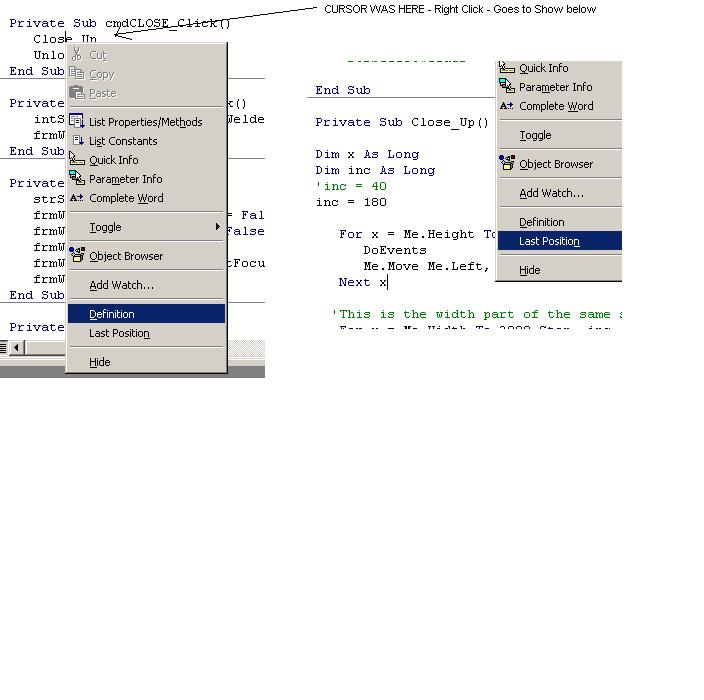

<div align="center">

## Hey, did you know? VERY Useful TIP


</div>

### Description

Hey everyone. A great TIP here! I don't know if this has been brought up before (did a search but found nothing) it may even be in VB books - but some of you may not know this...

Did you know that (in the code) you can right-mouse click over a particular procedure, function, word, method, event, any declared variable, etc... Then choosing "DEFINITION" from the menu selection will jump you to where it was declared or the code for it?! See screen shot for example of this.

Then after you get there, right-mouse click again and choose LAST POSITION to jump back where you came from?

How useful is this? Coulden't remember how something was declared? Need to check the code real quick for a function? You have several modules/forms/classes in your code?, etc...

Give it a try (similar to highlighting something and pressing F1 for help)

This may be a simple trick and many of you may already know this. But for those of you that don't, please VOTE. I think it's worth it. Comments are welcome.
 
### More Info
 


<span>             |<span>
---                |---
**Submitted On**   |
**By**             |[Jeff D](https://github.com/Planet-Source-Code/PSCIndex/blob/master/ByAuthor/jeff-d.md)
**Level**          |Beginner
**User Rating**    |4.4 (212 globes from 48 users)
**Compatibility**  |VB 4\.0 \(32\-bit\), VB 5\.0, VB 6\.0
**Category**       |[Miscellaneous](https://github.com/Planet-Source-Code/PSCIndex/blob/master/ByCategory/miscellaneous__1-1.md)
**World**          |[Visual Basic](https://github.com/Planet-Source-Code/PSCIndex/blob/master/ByWorld/visual-basic.md)
**Archive File**   |[](https://github.com/Planet-Source-Code/jeff-d-hey-did-you-know-very-useful-tip__1-35543/archive/master.zip)


### Source Code

```
Hey everyone. A great TIP here! I don't know if this has been brought up before (did a search but found nothing) it may even be in VB books - but some of you may not know this...
Did you know that (in the code) you can right-mouse click over a particular procedure, function, word, method, event, any declared variable, etc... Then choosing "DEFINITION" from the menu selection will jump you to where it was declared or the code for it?! See screen shot for example of this.
Then after you get there, right-mouse click again and choose LAST POSITION to jump back where you came from?
How useful is this? Coulden't remember how something was declared? Need to check the code real quick for a function? You have several modules/forms/classes in your code?, etc...
Give it a try (similar to highlighting something and pressing F1 for help)
This may be a simple trick and many of you may already know this. But for those of you that don't, please VOTE. I think it's worth it. Comments are welcome.
```

